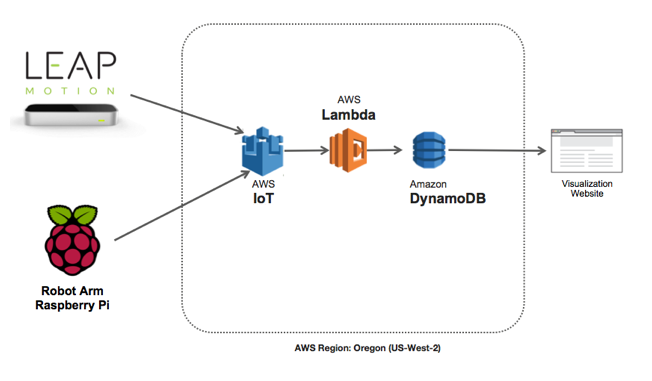
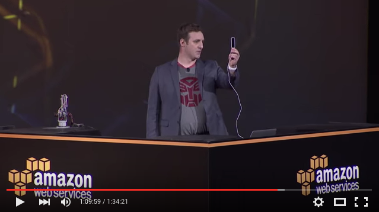
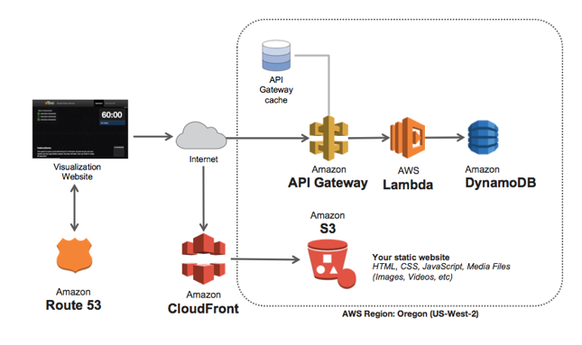

# Simple Robot Service

SRS is a cloud-connected robot arm that subscribes to a gesture input device (Leap Motion) via the AWS IoT service. Observe metrics such as x, y, z coordinate movement and hand gestures in near real-time through a custom JavaScript application running on Amazon S3.

## Overview

Simple Robot Service uses AWS IoT to send messages between a publisher and a subscriber. The **publisher.py** script will run on the computer connected to the LEAP motion controller. The **subscriber.py** script will run on the raspberry pi that has the Adafruit Servo Hat and the Robotic Arm connected.



Simple Robot Service was demonstrated during the AWS keynote address at Re:Invent 2015.

[](https://youtu.be/y-0Wf2Zyi5Q?t=4176)

[Click here to play the video.](https://youtu.be/y-0Wf2Zyi5Q?t=4176)

### Bill of Materials

Complete list:
http://www.amazon.com/registry/giftlist/10S3G6J5UJBXO

This includes:
- [Raspberry Pi](http://www.amazon.com/dp/B008XVAVAW)
- [Adafruit Servo Hat for Raspberry Pi](http://www.amazon.com/dp/B00XW2OY5A)
- [Robotic Arm](http://www.amazon.com/dp/B00NB1DFF2)
- [LEAP Motion Controller](http://www.amazon.com/dp/B00HVYBWQO)

## Setting up AWS IoT

1. Click on the **AWS IoT (Beta)** icon in the AWS Management Console.

2. Press **Getting Started**.

3. There are three resources that need to be created. An IoT "Thing", a certificate and associated keys and a policy. To start, click **Create a thing** and then type *LeapMotionController* as the name of the thing. Press **Create**.

4. Next, download the X.509 certificates. Click **Create a certificate**, followed by **1-Click Certificate Create**. Download the three files that are created. These files are needed to connect over TLS from both the local computer with the LEAP Motion Controller and the Raspberry Pi.

5. Now, create a policy to interact with the IoT resources. Click **Create a policy**. This example will be very permissive. In a real-world scenario, the policies that are created should only allow specific read/write permissions to specific IoT resources. Call the policy **LeapMotionPolicy**. Define the action as **iot:\*** and the Resource as **\***. Press **Create**.

6. The final step is to attach the policy and the thing (Leap Motion Controller) to the certificate. On the AWS IoT dashboard, click the checkbox under the certificate. In the actions dropdown, click **Activate** followed by **Attach a Policy** and **Attach a Thing**. Attach the policy and the thing that was made in the previous steps.

*NOTE:*
A root certificate is required to complete the TLS connection to AWS IoT from the devices. Here is the link to the AWS IoT root certificate:

https://www.symantec.com/content/en/us/enterprise/verisign/roots/VeriSign-Class%203-Public-Primary-Certification-Authority-G5.pem

## LEAP Motion

Create an account at https://developer.leapmotion.com/ and download the SDK. Once done, copy over the following files to the **devices/lib** directory:
- Leap.py
- LeapPython.so
- libLeap.dylib

Next, setup the LEAP development environment following the guides below.

- https://developer.leapmotion.com/documentation/java/devguide/Project_Setup.html
- https://developer.leapmotion.com/documentation/python/devguide/Sample_Tutorial.html

## Adafruit PWM/Servo Hat

On the Raspberry Pi, the Adafruit PWM/servo libraries are required. Download them to the Raspberry Pi from here: https://github.com/adafruit/Adafruit-PWM-Servo-Driver-Library

```
git clone https://github.com/adafruit/Adafruit-PWM-Servo-Driver-Library.git
```

- http://www.amazon.com/Adafruit-16-Channel-PWM-Servo-Raspberry/dp/B00XW2OY5A
- https://learn.adafruit.com/adafruit-16-channel-pwm-servo-hat-for-raspberry-pi/overview

## Operation

The following python libraries are required:

```
pip install schedule paho-mqtt
```

To operate the robotic arm, attach the LEAP motion controller to the laptop and run: **python publisher.py**. Secondly, SSH into the IoT device and copy over the application files. Run **python subscriber.py** on the raspberry-pi. The arm should now move when gestures are made above the LEAP Motion Controller.

## Web Visualization

Visualize this data in real-time by running the web application code found in the web/ directory.



In order to visualize the data from various locations, we will need to store the data in a database. In this example, AWS IoT is used to invoke a Lambda function that writes to DynamoDB based on a defined rule. All of the resources with exception of the AWS IoT resources can be created using cloudformation. Two cloud formation scripts are included, one for custom domains that includes route53 hosted zone information (**srs-with-domain.json**), and one that uses AWS provided S3 URLs (**srs.json**). The two scripts can be found in the */cfn* folder.

### Setting up DynamoDB

First, create a new DynamoDB table to store the data. The DynamoDB table should have a hash key named **EventID** and a range key named **FrameID**. The data will be stored in a JSON object in this table. This table was created via the cloud formation script.

### Setting up Lambda and API Gateway

Next, create the Lambda functions. In the folder web/lambda there are two subfolders, **srsgetdata** and **srsputdata**. In each of these folders run:

```
npm install
```

This will download and install all of the required node modules. Then, edit **index.js** for each function and put in the DynamoDB table name created above and an EventID. After you have edited the index.js file and the NPM install process completes, zip up the contents of that directory (make sure that index.js is in the root of the zip file).

Once the zip file is ready, follow these steps:

1. Open the **Lambda** console.

2. Click on the **srsputdata-XXXXXXXXX** function. Upload the **srsputdata** zip file that was created above.

3. Click on the **srsgetdata-XXXXXXXXX** function. Upload the **srsgetdata** zip file that was created above.

4. In **srsgetdata**, click the API Endpoints tab. Create a new endpoint for this function and enable CORS. Note the endpoint that was created.

### Setting up an AWS IoT Rule and Action

1. First, let's create a rule. Press **Create a rule**. Type **LeapMotionRule** as the rule name and give it a description.

2. In the Rule Query Statement section, type **\*** in the attribute field and **srs** in the topic filter.

3. Next, let's add an action to this rule. In the drop down list select **Insert this message into a cloud function and run it (Lambda)**.

4. Once done, press **Add Action** followed by **Create**. Select the SRS Put Data lambda function in the drop down.

### Uploading the web application files to Amazon S3.

1. In the web application files, find **main.js**. Update the *ENDPOINT* variable to point to the AWS API Gateway endpoint created above.

2. Open the file Gruntfile.js and look for the following code snippet:

    ```
    grunt.registerTask('publish', [
      'build',
      'exec:s3push:<SRS_BUCKET_NAME>:<PROFILE>:us-east-1'
    ]);
    ```

3. Replace *SRS_BUCKET_NAME* with the name of the website bucket and *PROFILE* with the name of the AWS CLI profile to use. The profile can be set as *default*.

4. Use the command line to open the **web/** directory. Here are some commands that are provided by this Gruntfile:

    ```
    grunt serve # Builds the code and runs a local web server.
    grunt build # Builds the code
    grunt publish # Builds the code and publishes to S3
    ```

5. Alternatively, upload the files directly after a **grunt build** using the browser. Simply upload all of the files in the **/dist** folder to the S3 bucket.
